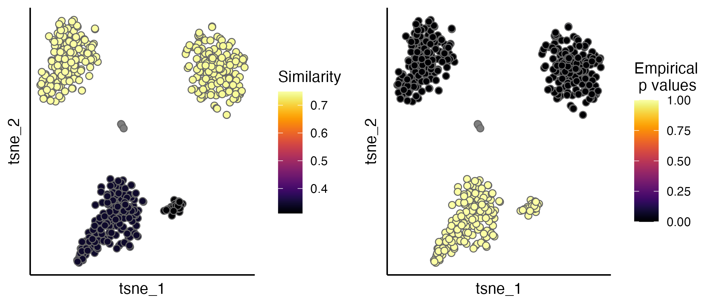
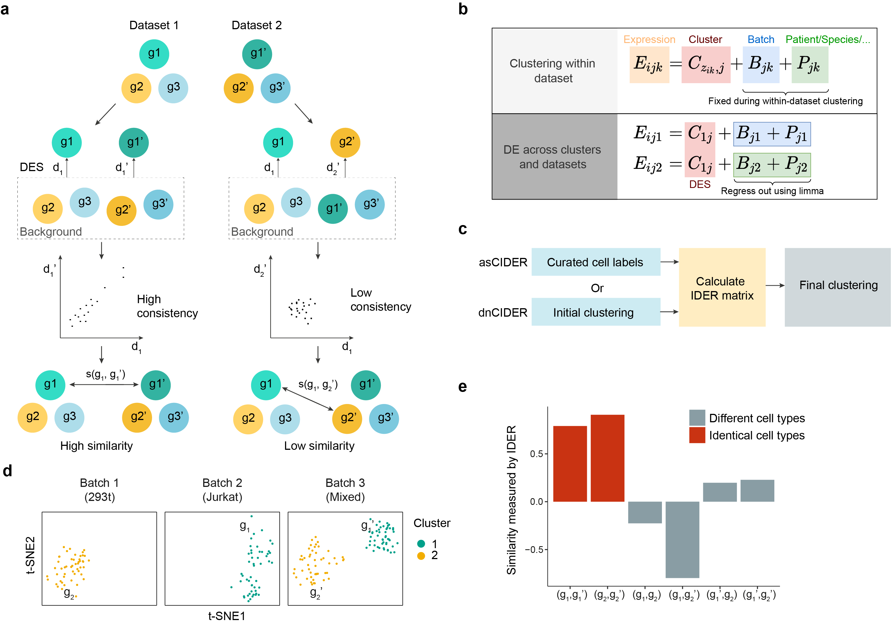

<!-- README.md is generated from README.Rmd. Please edit that file -->

# CIDER

<!-- badges: start -->
<!-- badges: end -->

**CIDER** is a meta-clustering workflow designed to handle scRNA-seq
data that span multiple samples or conditions. Often, these datasets are
confounded by batch effects or other variables. Many existing
batch-removal methods assume near-identical cell population compositions
across samples. CIDER, in contrast, leverages **inter-group similarity
measures** to guide clustering without requiring such strict
assumptions.

- Genome Biology (2021) publication: [CIDER
  article]((https://genomebiology.biomedcentral.com/articles/10.1186/s13059-021-02561-2))
- Original prototype: [Hu et al., *Cancer Cell*
  2020](https://www.sciencedirect.com/science/article/pii/S1535610820300428)

## Highlights

- **Clustering**: Overcome confounders in scRNA-seq data (e.g., batch
  effects) without requiring identical cell-type composition.
- **Evaluation metric**: Assess whether integrated data from methods
  like Seurat-CCA, Harmony, or Scanorama preserve meaningful biological
  structure—no prior cell-type labels required.

## Installation

You can install CIDER from
[github](https://github.com/zhiyuan-hu-lab/CIDER/) with:

``` r
# install.packages("devtools")
devtools::install_github('zhiyuan-hu-lab/CIDER')
```

## Quick Start: Using CIDER as an Evaluation Metric

If you have **already integrated** your scRNA-seq data (e.g., using
Seurat-CCA, Harmony, or Scanorama) and want to **evaluate** how well the
biological populations align post-integration, you can use CIDER as
follows.

1.  Before running CIDER evaluation functions, make sure that you have a
    Seurat object (e.g. `seu.integrated`) with corrected PCs in

``` r
seu.integrated@reductions$pca@cell.embeddings`
```

- Seurat-CCA automatically put the corrected PCs there.
- If other methods are used, the corrected PCs can be added using

``` r
seu.integrated@reductions$pca@cell.embeddings <- corrected.PCs
```

2.  Run **hdbscan** clustering (optional) and compute the IDER score:

``` r
library(CIDER)
seu.integrated <- hdbscan.seurat(seu.integrated)
ider <- getIDEr(seu.integrated, verbose = FALSE)
seu.integrated <- estimateProb(seu.integrated, ider)
```

3.  Visualize evaluation scores on t-SNE or UMAP:

The evaluation scores (IDER-based similarity and empirical p values) can
be visualised by the `scatterPlot` function.

``` r
p1 <- scatterPlot(seu.integrated, "tsne", colour.by = "similarity")
p2 <- scatterPlot(seu.integrated, "tsne", colour.by = "pvalue") 
plot_grid(p1,p2, ncol = 2)
```

<figure>

<figcaption aria-hidden="true">Evaluation scatterplot showing
CIDER-based p-values and similarity</figcaption>
</figure>

For a more detailed walkthrough, see the [detailed tutorial of
evaluation](https://zhiyuan-hu-lab.github.io/CIDER/articles/evaluation.html)

## Using CIDER for Clustering Tasks

<!--- --->

In many scenarios, you do **not** start with an integrated Seurat object
but still need to cluster multi-batch scRNA-seq data in a robust way.
CIDER provides meta-clustering approaches:

- asCIDER: When you have initial batch-specific clusters.
- dnCIDER: When you do **not** have any initial cluster labels.

### Quick Start with asCIDER

If your Seurat object (`seu`) has:

- `initial_cluster` in `seu@meta.data` for per-batch clusters, and
- `Batch` for batch labels,

then two main steps are:

``` r
# Step 1: Compute IDER-based similarity
ider <- getIDEr(seu, 
                group.by.var = "initial_cluster",
                batch.by.var = "Batch")

# Step 2: Perform final clustering
seu <- finalClustering(seu, ider, cutree.h = 0.45)
```

The final clusters will be stored in `seu@meta.data$final_cluster` (by
default).

- Detailed tutorial: [asCIDER
  tutorial](https://zhiyhu.github.io/CIDER/articles/asCIDER.html)
- If you do not have prior batch-specific clusters, see [dnCIDER
  high-level](https://zhiyhu.github.io/CIDER/articles/dnCIDER_highlevel.html)
  or the [dnCIDER detailed
  walk-through](https://zhiyhu.github.io/CIDER/articles/dnCIDER.html).

<!--- You'll still need to render `README.Rmd` regularly, to keep `README.md` up-to-date. `devtools::build_readme()` is handy for this. You could also use GitHub Actions to re-render `README.Rmd` every time you push. An example workflow can be found here: <https://github.com/r-lib/actions/tree/master/examples>.--->

## Citation

If you find **CIDER** helpful for your research, please cite:

Z. Hu, A. A. Ahmed, C. Yau. CIDER: an interpretable meta-clustering
framework for single-cell RNA-seq data integration and evaluation.
*Genome Biology* **22**, Article number: 337 (2021); [doi:
https://doi.org/10.1186/s13059-021-02561-2](https://genomebiology.biomedcentral.com/articles/10.1186/s13059-021-02561-2)

Z. Hu, M. Artibani, A. Alsaadi, N. Wietek, M. Morotti, T. Shi, Z. Zhong,
L. Santana Gonzalez, S. El-Sahhar, M. KaramiNejadRanjbar, G. Mallett, Y.
Feng, K. Masuda, Y. Zheng, K. Chong, S. Damato, S. Dhar, L. Campo, R.
Garruto Campanile, V. Rai, D. Maldonado-Perez, S. Jones, V. Cerundolo,
T. Sauka-Spengler, C. Yau*, A. A. Ahmed*. The repertoire of serous
ovarian cancer non-genetic heterogeneity revealed by single-cell
sequencing of normal fallopian tube epithelial cells. Cancer Cell 37
(2), p226-242.E7 (2020). [doi:
https://doi.org/10.1101/2021.03.29.437525](https://www.sciencedirect.com/science/article/pii/S1535610820300428)
